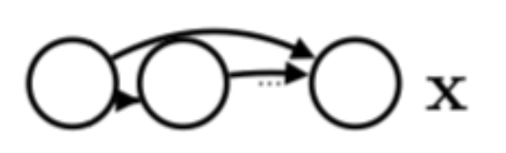
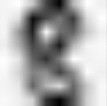
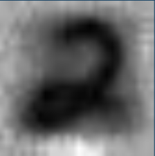

# Deep-Autoregressive-Models

## Description
In this project, we explore deep autoregressive models for density estimation such as Neural Autoregressive Density Estimator (NADE) and Masked Autoregressive Density Estimation (MADE). Our hypothesis is that deep autoregressive models such as MADE generate richer samples than those generated by mixture models such as GMM. We verify the hypothesis by training a MADE model and a GMM on 3 different datasets (MNIST, Atari frames and Anime faces) and comparing the samples generated. 

The final presentation can be found [here](Project_presentation.pdf) (relative link).

## Models explored
### 1. Neural Autoregressive Density Estimator (NADE):

NADE is a Bayesian Network model for density estimation having an "autoregressive property" in which the full joint probability of all random variables is given as:

All of the conditional distributions are modelled by a neural network:

Our implementation code for NADE with all the conducted experiments can be found in the NADE [subfolder](NADE).

### 2. Masked Autoregressive Density Estimation (MADE):

MADE is a deep, generative autoencoder capable of learning hierarchies of distributed representations from data. Its an extension of NADE where all conditional distributions are learnt using a masked variational autoencoder. The masks are generated such that they sustain the autoregressive property of the model by dropping out suitable connections. Our implementation code for MADE with all the conducted experiments can be found in the pytorch-MADE [subfolder](pytorch-MADE).

### 3. GMM (as baseline)

## Results

### 1. MNIST:

### 2. Atari game frames:

### 3. Anime faces:

